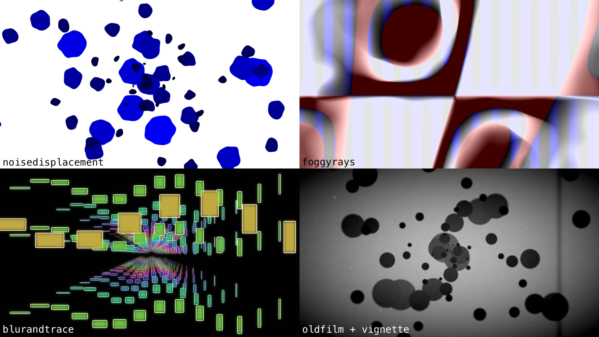

# postpre

postpre is a collection of presets for the post-processing library
[merge-pass](https://github.com/bandaloo/merge-pass).

## Live Example

This [live example](https://www.bandaloo.fun/postpre/example.html)
shows off all the different preset effects. There are sliders that allow you
to play with all the parameters, so check it out!

## Usage

This library provides extra effects and effect loops on top of merge-pass.
Copied from the merge-pass readme:

> This [usage example](https://github.com/bandaloo/merge-pass-usage) will show
> you how to get started with using 2D images such as canvases and videos. This
> [other example](https://github.com/bandaloo/one-context-merge-pass) shows you
> how to use this library with only a single WebGL2 rendering context and
> textures instead of images.

The [live example](https://www.bandaloo.fun/postpre/example.html)
also contains code examples, and is similar to the
[merge-pass live example](https://www.bandaloo.fun/merge-pass/example.html)
which also contains code examples at the bottom.
